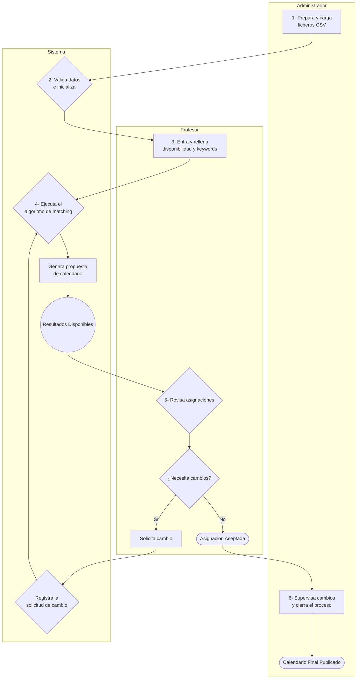

# [WIP] TFGPlanner

## Descripción

Herramienta web interna diseñada para simplificar y automatizar la gestión y asignación de tribunales para las defensas de Trabajos de Fin de Grado (TFG). El sistema facilita la coordinación entre profesores y la asignación de defensas basándose en la disponibilidad, especialización y carga de trabajo de cada docente.

Este proyecto busca solucionar los siguientes problemas:
*   La complejidad de coordinar horarios y disponibilidades de múltiples profesores.
*   La dificultad de asignar tribunales de manera equitativa y considerando la especialización de cada profesor.
*   La falta de una vista centralizada del estado de todas las defensas.

La herramienta está dirigida principalmente a administradores del departamento y a profesores que participan en las defensas de TFG.

## Índice

*   [Actores del sistema](#actores-del-sistema)
*   [Flujo de trabajo](#flujo-de-trabajo)
*   [Especificaciones funcionales](#especificaciones-funcionales)
    *   [Paso 1: Carga de datos](#paso-1-carga-de-datos)
    *   [Paso 2: Interfaz del profesor](#paso-2-interfaz-del-profesor)
    *   [Paso 3: Algoritmo de matching](#paso-3-algoritmo-de-matching)
    *   [Paso 4: Visualización de resultados](#paso-4-visualización-de-resultados)
    *   [Paso 5: Gestión de cambios](#paso-5-gestión-de-cambios)
*   [Estructura de datos](#estructura-de-datos)
*   [Tecnologías propuestas](#tecnologías-propuestas)
*   [Instalación y despliegue](#instalación-y-despliegue)
*   [Roadmap (Futuras mejoras)](#roadmap-futuras-mejoras)
*   [Licencia](#licencia)
*   [Contacto](#contacto)

## Actores del sistema

*   **Administrador:** Encargado de inicializar el sistema con la información de profesores y TFGs. Supervisa el proceso y valida los resultados.
*   **Profesor:** Participa en el proceso indicando su disponibilidad, áreas de especialización (keywords) y los TFGs que ha dirigido.

## Flujo de trabajo

El proceso se desarrolla en varias fases, desde la carga inicial de datos por parte del administrador hasta la publicación final del calendario de defensas.



## Especificaciones funcionales

### Paso 1: Carga de datos

*   El administrador prepara y sube al sistema dos ficheros en formato **CSV**: uno para `profesores.csv` y otro para `tfgs.csv`.
*   El sistema validará las columnas y los formatos de los ficheros, notificando al administrador si encuentra errores.
*   A futuro, este proceso podría automatizarse mediante un script que genere los CSV a partir de otras fuentes de datos de la universidad.

### Paso 2: Interfaz del profesor

*   **Página de bienvenida:** Al acceder a la URL, el profesor se identificará introduciendo su correo electrónico (que debe existir en `profesores.csv`).
*   **Gestión de keywords:** El profesor podrá añadir, editar o eliminar sus keywords de especialización.
*   **Gestión de disponibilidad:**
    *   Se presentará una cuadrícula interactiva para un período definido (~5 días).
    *   Los slots de tiempo serán de una hora.
    *   Para cada slot, el profesor podrá elegir su estado: `Presencial`, `Online` o `No disponible`.
*   **Gestión de TFGs dirigidos:**
    *   Se mostrará una lista de todos los TFGs.
    *   El profesor marcará los TFGs que ha dirigido.
    *   En caso de codirección, podrá indicar si desea ser presidente del tribunal. Al menos uno de los codirectores deberá asumir este rol.

### Paso 3: Algoritmo de matching

El sistema asignará los tribunales (1 presidente + 2 vocales por TFG) aplicando las siguientes reglas y criterios de preferencia.

**Restricciones (obligatorias):**

*   **Composición del tribunal:** Cada tribunal debe tener un presidente y dos vocales.
*   **Director en tribunal:** El director (o uno de los codirectores) debe formar parte del tribunal.
*   **Carga de tribunales:** Cada profesor debe participar en un número de tribunales proporcional a los TFGs que ha dirigido (aproximadamente 3 tribunales por TFG dirigido).
*   **Disponibilidad de miembros:** Todos los miembros asignados a un tribunal (presidente y vocales) deben tener disponibilidad (`Presencial` u `Online`) en el slot de tiempo seleccionado.

**Criterios de asignación y modalidad:**

1.  **Modalidad de la defensa (Regla clave):**
    *   **Presencial (Máxima prioridad):** Se asignará esta modalidad si y solo si **todos los miembros del tribunal** (presidente, vocal 1 y vocal 2) tienen disponibilidad `Presencial` en ese slot.
    *   **Híbrido/Online:** Si no es posible formar un tribunal 100% presencial, el sistema buscará una combinación de miembros con disponibilidad `Presencial` y `Online`, o solo `Online`, para asegurar la defensa.
2.  **Maximizar coincidencia de keywords:** Se priorizará la asignación de vocales cuyas keywords coincidan en mayor medida con las del TFG.

### Paso 4: Visualización de resultados

Los resultados de la asignación se podrán consultar en dos vistas principales:

*   **Vista de tabla:**
    *   Permitirá filtrar para ver "Todos los TFGs" o "Solo mis TFGs".
    *   Columnas: Título del TFG, Alumno, Fecha y Hora, Sala, Modalidad, Presidente, Vocal 1, Vocal 2.
*   **Vista de calendario:**
    *   Mostrará las defensas en un calendario semanal o diario.
    *   Permitirá filtrar para ver "Todos los TFGs" o "Solo mis TFGs".
    *   Ofrecerá una opción para descargar los eventos en formato `.ics` para importarlos en calendarios personales.

### Paso 5: Gestión de cambios

*   Se habilitará un período para que los profesores puedan solicitar cambios.
*   **Tipos de cambios permitidos:**
    *   **Cambio de miembro:** Proponer un sustituto (requiere confirmación del sustituto y del administrador).
    *   **Cambio de fecha/hora:** Proponer un nuevo slot (requiere confirmación de todos los miembros).
    *   **Cambio de modalidad:** Solicitar el cambio entre `Presencial`, `Híbrido` y `Online`.
*   **Historial de cambios:** Todas las solicitudes y acciones quedarán registradas en un log visible para los implicados y el administrador.

## Estructura de datos

La información se gestionará a través de ficheros CSV.

**`profesores.csv`**
| columna | tipo | descripción |
| :--- | :--- | :--- |
| `nombre` | String | Nombre completo del profesor. |
| `correo` | String | Correo electrónico (identificador único). |
| `keywords` | String | Lista de keywords separadas por comas. |
| `tfgs_dirigidos`| String | Lista de IDs de TFG separados por comas. |

**`tfgs.csv`**
| columna | tipo | descripción |
| :--- | :--- | :--- |
| `id_tfg` | String | Identificador único del TFG. |
| `titulo_tfg` | String | Título del Trabajo de Fin de Grado. |
| `nombre_alumno`| String | Nombre del estudiante. |
| `correo_alumno`| String | Correo del estudiante. |
| `enlace_tfg` | String (URL)| Enlace al documento del TFG. |
| `keywords_tfg` | String | Lista de keywords separadas por comas. |
| `sala_defensa` | String | Sala física asignada. |

La disponibilidad de los profesores se guardará en un fichero aparte (e.g., `disponibilidad.json` o `disponibilidad.csv`) una vez la rellenen.

## Tecnologías propuestas

Para mantener una infraestructura sencilla, se propone una arquitectura 100% Python.

*   **Backend y Frontend:**
    *   **Opción 1 (Framework tradicional):** Usar un microframework como **Flask** o **FastAPI**. El frontend se generaría con plantillas del lado del servidor (**Jinja2**) y una mínima cantidad de JavaScript para la interactividad si fuera necesario.
    *   **Opción 2 (Framework de datos):** Utilizar **Streamlit** o **Dash**. Estas librerías son excelentes para crear aplicaciones web interactivas directamente en Python con menos código, ideal para herramientas internas y visualización de datos.
*   **Almacenamiento de datos:**
    *   **Principal:** Ficheros **CSV** para la carga inicial de datos. La información de disponibilidad y los resultados se pueden gestionar con la librería **Pandas** y guardar en CSV o JSON.
    *   **Alternativa:** Si se necesita mayor consistencia o consultas más complejas, se puede utilizar **SQLite**, ya que es una base de datos ligera basada en un único fichero y está incluida en la librería estándar de Python.

## Instalación y despliegue

(Esta sección se completará a medida que avance el desarrollo)

```bash
# Clonar el repositorio
git clone https://github.com/OscarPellicer/TFGPlanner.git

# Crear un entorno virtual e instalar dependencias
cd TFGPlanner
python -m venv venv
source venv/bin/activate
pip install -r requirements.txt

# Ejecutar la aplicación en el servidor
python main.py
```

## Roadmap (Futuras mejoras)

*   **Notificaciones por correo electrónico:** Envío automático de correos sobre asignaciones y cambios.
*   **Migración de almacenamiento:** Si la aplicación crece, migrar de CSV a una base de datos SQLite para mejorar el rendimiento y la integridad de los datos.
*   **Integración con sistemas universitarios:** Conectar con la base de datos de la universidad para la carga automática de datos.
*   **Algoritmo de matching mejorado:** Incorporar más variables como la carga docente histórica de cada profesor.

## Licencia

Este proyecto se distribuye bajo licencia Apache 2.0

## Contacto

Para cualquier duda o sugerencia: oscar.pellicer at uv.es
